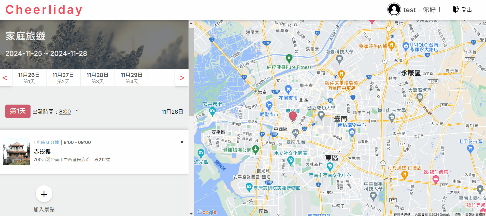
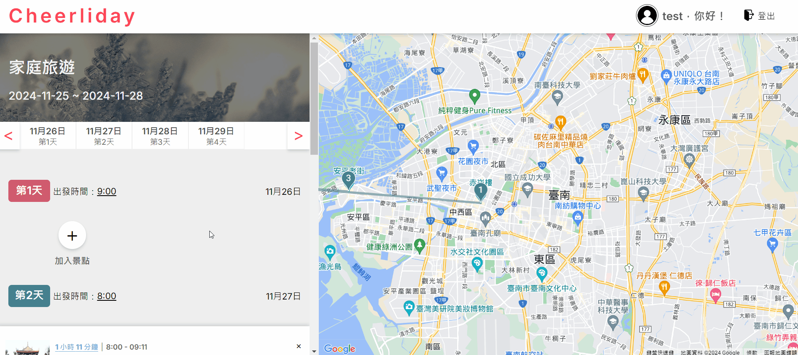

<h2 style="font-size: 25px; font-weight: bold;">Cheerliday</h2>

<h3>Cheerliday 是一個幫助旅行者高效安排行程的網站。用戶可以添加旅行目的地，通過拖拉功能調整景點順序，並即時在地圖上查看各個景點的位置。可以調整出發時間及預計停留的時間，讓行程安排更加彈性。用戶還能探索其他旅行者分享的計劃，獲取靈感和建議。
</h3>

<h2 style="font-size: 25px; font-weight: bold;">使用範例</h2>

###  Step 1: 創建你的旅程
<table>
  <tr>
    <td width="60%"></td>
    <td>
      <h3>🌟 開啟你的旅行計劃</h3>
      <ul style="font-size: 16px;">
        <li>為旅程取一個獨特的名字</li>
        <li>選擇理想的出發日期</li>
        <li>輸入目的地城市，地圖將自動聚焦</li>
        <li>一切就緒，準備開始精彩的規劃吧！</li>
      </ul>
    </td>
  </tr>
</table>

### Step 2: 添加精彩景點
<table>
  <tr>
    <td width="60%"></td>
    <td>
      <h3>🔍 探索和收集目的地亮點</h3>
      <ul style="font-size: 16px;">
        <li>輸入景點名稱，獲取詳細資訊</li>
        <li>輕鬆將景點加入你的行程清單</li>
        <li>地圖上以不同顏色顯示每天的行程路線</li>
        <li>每一天的行程都清晰可見，一目了然</li>
      </ul>
    </td>
  </tr>
</table>

### Step 3: 優化你的行程
<table>
  <tr>
    <td width="60%"></td>
    <td>
      <h3>🎨 打造完美的時間安排</h3>
      <ul style="font-size: 16px;">
        <li>輕鬆拖拽重新安排行程順序</li>
        <li>靈活調整每個景點的停留時間、預計出發時間</li>
        <li>系統自動計算交通時間，優化你的旅程</li>
        <li>隨時查看和調整，確保行程順暢</li>
      </ul>
    </td>
  </tr>
</table>

### Step 4: 管理行程隱私
<table>
  <tr>
    <td width="60%"></td>
    <td>
      <h3>🌍 分享靈感，保護隱私</h3>
      <ul style="font-size: 16px;">
        <li>瀏覽其他用戶分享的精彩行程，獲取靈感</li>
        <li>自由選擇是否公開你的旅行計劃</li>
      </ul>
    </td>
  </tr>
</table>

<h2 style="font-size: 25px; font-weight: bold;">技術架構</h2>

### 框架與語言

- **Next.js**：使用 App Router 實現動態和靜態路由生成，提供整體應用架構。
- **React**：構建用戶界面，結合 React Context 管理全局用戶狀態。
- **TypeScript**：增強代碼的可維護性和類型安全。

### 用戶界面

- **Ant Design (antd)**：應用於用戶時間的選擇，以及探索行程頁面的排版與響應式設計。
- **react-beautiful-dnd**：實現行程安排的拖放功能，讓使用者自由調整景點順序。
- **react-datepicker**：處理建立行程的日期選擇。
- **CSS Modules**：實現樣式封裝，避免樣式衝突。

### 資料管理與同步

- **Firebase**：
  - Firestore：用於資料存儲，利用 onSnapshot 提供即時數據同步。
  - Authentication：處理用戶認證，實現會員系統。

### 地圖與位置服務
- **Google Maps API** (@vis.gl/react-google-maps)：提供地圖顯示、位置標記、景點搜索以及交通時間計算功能。

### 輔助工具與優化
- **dayjs**：處理日期相關操作。

### 部署與托管
- **Vercel**：用於專案的部署和托管。

